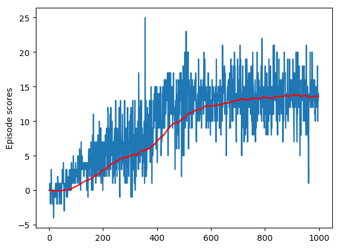

### Learning Algorithm

The agent implements a version of the Deep Q Network described in
https://storage.googleapis.com/deepmind-media/dqn/DQNNaturePaper.pdf.

Unlike the neural network described in the paper, this agent works with
a smaller number of sensor vectors and thus uses a fully connected network
as the underlying model.

It uses fixed Q targets, though the target network is updated gradually
using a weighting hyper parameter TAU rather than a sudden update.  It also
uses a buffer of experiences for learning with another hyper parameter
controlling the buffer size (i.e. experience replay).

### Training

The following plots both the per episode score and the 100 episode moving
average:

The final average score was 13.52

### Ideas for improvement

There are multiple strategies for improving on the original Deep Q network
algorithm.  Some possibilities:

* Double DQN - Use one network for finding the argmax at a particular state,
  then convert that state into a value (i.e. argmax -> max) using a second
  network.  With two networks, the algorithm should be less prone to
  overestimation of q values due to random noise.
* Prioritized Experience Replay - Rather than randomly sampling from the
  experience buffer during learning, instead weight samples based on the
  expected information they contain.  We estimate the information content of a
  sample using the divergence of the estimated reward vs the actual reward.
* Dueling DQN - Have separate nerworks for estimating the advantage function
  (i.e. the optimal action) and the value function.  Then combine the output
  of these networks into the final q-value estimation.
